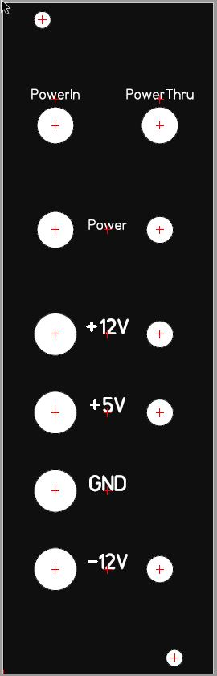
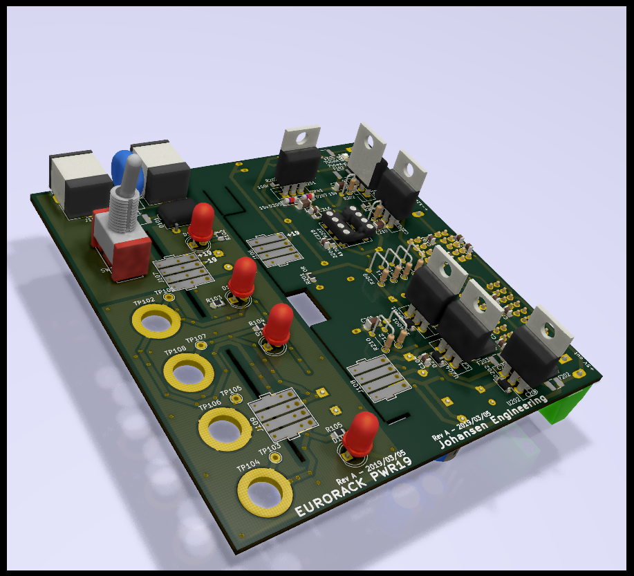
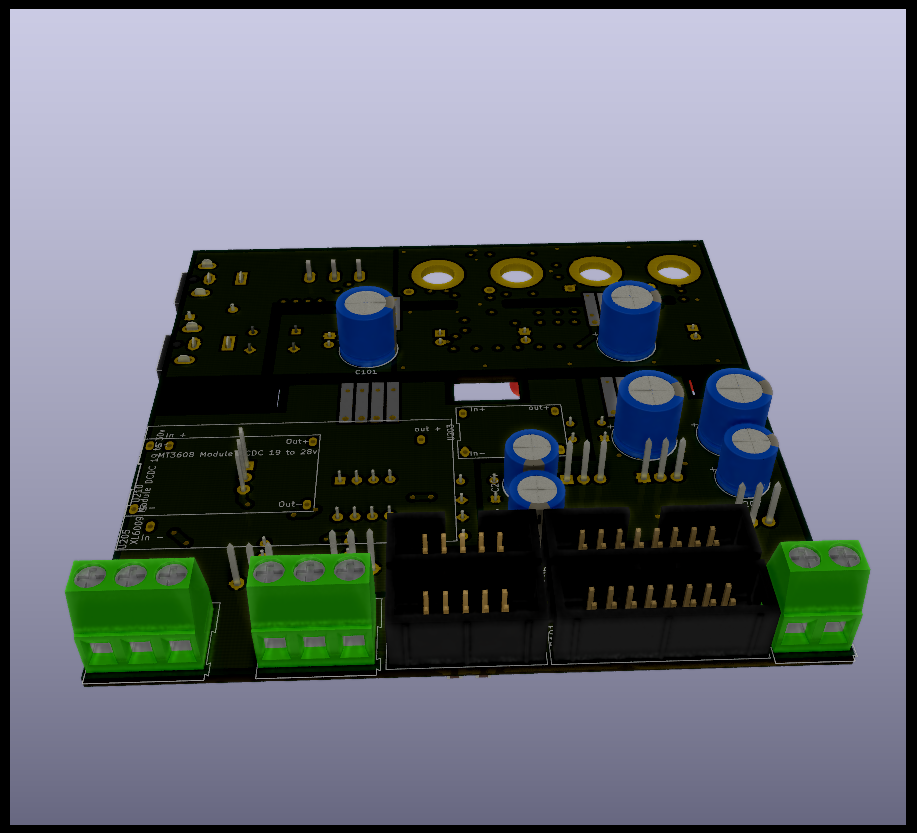

# KicadJE-EuroPowerSupply
Takes a Laptop 19V input and makes +-12 and 5 v out

# MK1 Design
## Status - Installed in Rack
## Initial Unit
| Stage  | Detail | Status |
| ------------- | ------------- | ------------- |
| create material  | sch/pcb | done  |
| | gerber | done |
| production  |   | done |
|  | produced | Done |
|  | delivered | Done |
## Preliminary validation
| Test  | Detail | Status |
| ------------- | ------------- | ------------- |
| Initial Inspection |  | OK |
| Initial Technical Test |   | OK see errata |
| Initial Product Test |   | OK |

## Secondary validation
| Test  | Detail | Status |
| ------------- | ------------- |------------- |
| Product Test |  | OK |
| Quality |  | |
| Long Term Product Test | | Installed in rack  - extended to "EuroPowerCon" via +-13,5v |
| |  | Working fine after 1 year with different modules coming and going |

## Second Unit tests
| Test  | Action | Status |
| ------------- | ------------- |------------- |
| Lower Power Consumption | Bypass Line regulation TIP41 and turn down DCDC to 27v |  |
| Lower Power Consumption | twist the offset of VGND in favor of a Vss = -14v Vcc = -13v |  |
| Simplify | Ommit Banana Jacks | |

## Errata
 * U203 DCDC 5V stepdn converter mirrored pinout - mount on other side (where there is more room)
 * Smaller +28V DCDC does not work - they burn themselves (tried 3 units)
## Issues and Notes
Note - as most powerdraw is on the +12V and +5V side the negative rail is not pulling down the VGND and the TIP42 needs to do all the heavy lifting - resulting in wasting almost 1/2 the power in this transistor.

The TIP41 line regulator passes all the current and the more regulation it needs to perform the more power it wastes and the hotter it gets. Therefore the Zener input should be matched well with the DCDC Boosted output to avoid power wastage.

Another result is a higher Current draw on the primary side, which will blow the input fuse faster. As a result - a powerdraw of 200mA on +12v will result in almost 0,5A on the primary side.

 * Bananas cant be mounted on PCB - too short
 * Consider soft startup current
 * Consider larger drill size for 7812 7805 and 7912
 * Consider cooling of TIP41's and TIP42
 * Blue LED is brighter than RED - Consider 1k for RED +12 470R for RED +5 and 1k5 for BLUE 
### Workarounds
 * U203 DCDC 5V stepdn converter mirrored pinout - mount on other side (where there is more room - and easier adjustment options)

# Base Construction 
The idea is to have a laptop power supply provide the power for the synth, as they are powerful and inexpensive.

## Inputs
19v DC barrel jack.

## Outputs
### Front side
 - Banana +12v
 - Banana +5v
 - Banana GND
 - Banana -12v

### Back side
 - 10 pin doepfer connector
 - 16 pin doepfer connector
 - +/- 12v connector
 - +5 v connector

## Electrical
The input is fed to a DC-DC boost converter (to 30volts) and to a virtual GND circuit (making it +-15v) for the +-12v supply.
The +15v is sent to a step down converter (to 7volts) for the +5v supply.
The +-15 and +7 volt supplies are provided through common mode chokes to linear regulators.

## Regulation and noise 
### Input
No filtering on the input except for the overvoltage protection and  smoothing capacitor after the bridge rectifier.
### DCDC - Boost 30v
Directly on the DCDC output is made room for a Zener regulated NPN for 28 or 30v depending on the boost converter.
The 30v is sent to a Virtual GND that has smoothing capacitors on the input and output.
After the VGND room has been made for either small resistors (forming an RC filter) or a common mode choke for high frequency filtering.
Regulation is performed after the RC / LC filter with linear 7812 / 7912 regulators.

### DCDC - Buck 5v

### Safety / Protection
The 19v is fed through a bridge rectifier to protect the circuit and allow for both AC and DC with any polarity. The circuit is protected on the input by a polyfuse and a VDR afterwards in parallel with a Zener (or TVS) in series w a small resistor to protect from overcurrent, over voltage and spikes.
The linear regulators are fused with polyfuses

## Physical
The product is an 8HP module for the front of a Eurorack synth.
